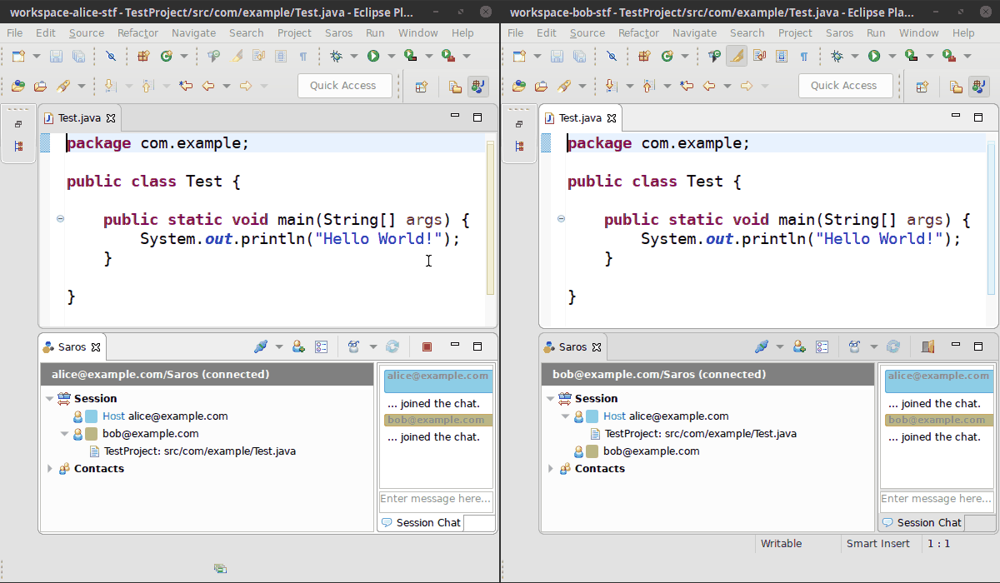

# Saros   

Is an Open Source plugin for connecting multiple IDEs for distributed collaborative software development.

* All participants get an **identical local copy** of the projects they work on.
* Each can work in their **usual IDE**.
* Saros keeps their copies **in sync**, so everyone can work completely **concurrently and in real-time**.

## Installation instructions
### Eclipse
- Via Marketplace Client: drag and drop [this link](http://marketplace.eclipse.org/marketplace-client-intro?mpc_install=856887 "Drag to your running Eclipse* workspace. *Requires Eclipse Marketplace Client") to your running Eclipse workspace
- Or add this update-site: https://www.saros-project.org/update-site/eclipse

### IntelliJ alpha release
Please read the [details about restrictions](https://www.saros-project.org/releases/saros-i_0.1.0.html) first, because Saros for IntelliJ is still a first alpha release!

- Search for "Saros" in the IntelliJ Marketplace (this requires the `alpha` release channel; more information on this is given in the [release notes](https://www.saros-project.org/releases/saros-i_0.1.0.html#installation))
- Or Download the plugin zip from our [release page](https://github.com/saros-project/saros/releases)

## Where to get help

- Documentation: https://www.saros-project.org/documentation
- Our gitter chat: 
- On Twitter: [@saros_project](https://twitter.com/saros_project)
- Mailing list: https://groups.google.com/group/saros-user

## You want to contribute to Saros?

Please take a look at our website: https://www.saros-project.org/contribute

