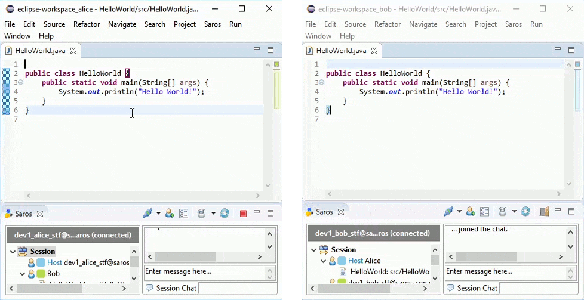

#  Saros - Distributed Party Programming

Saros is an Open Source plugin for connecting multiple IDEs for distributed collaborative software development.

* All participants get an **identical local copy** of the projects they work on.
* Each can work in their **usual IDE**.
* Saros keeps their copies **in sync**, so everyone can work completely **concurrently and in real-time**.

## Installation instructions
### Eclipse
- Via Marketplace Client: drag and drop [this link](http://marketplace.eclipse.org/marketplace-client-intro?mpc_install=856887 "Drag to your running Eclipse* workspace. *Requires Eclipse Marketplace Client") to your running Eclipse workspace
- Or add this update-site: https://www.saros-project.org/update-site/eclipse

### IntelliJ alpha release
Please read the [details about restrictions](https://www.saros-project.org/documentation/getting-started.html?tab=intellij#restrictions) first, because Saros for IntelliJ is still an alpha release!

- Search for "Saros" in the JetBrains Plugin Repository (this requires the `alpha` release channel; more information on this is given on the [installation](https://www.saros-project.org/documentation/installation.html?tab=intellij) page)
- Or Download the plugin zip from our [release page](https://github.com/saros-project/saros/releases)

## How to use Saros

Instructions on how to use Saros can be found on our [website](https://www.saros-project.org/documentation/getting-started.html?tab=eclipse).

## Where to get help

If you are having issues with Saros, you can have a look at our [documentation](https://www.saros-project.org/documentation) or ask a question
- on our user [Gitter chat](https://gitter.im/saros-project/saros/user)
- on our [user mailing list](https://groups.google.com/group/saros-user)

## Reporting a bug

We are using [Github issues](https://github.com/saros-project/saros/issues) as our bug/issue tracker.
To report an bug/issue, just create a new issue (if it does not already exist).
Please make sure to adhere to the guidelines provided by the issue templates.

## Contributing to Saros

If you are interested in contributing to the Saros project or have questions on a more technical level, you can have a look at our [contribution documentation](https://www.saros-project.org/contribute) or directly talk to us on
- our developer [Gitter chat](https://gitter.im/saros-project/saros)
- out [developer mailing list](https://groups.google.com/group/saros-devel)
