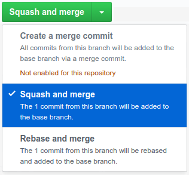
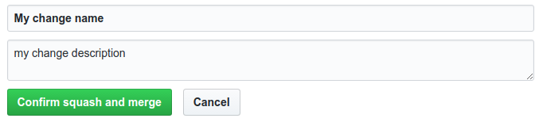

## Review Rules at a Glance

Make sure that your change:

* has a commit message that complies with the [guidelines](../guidelines.md#commit-message)
* is small
* is formatted as defined in the [guidelines](../guidelines.md#formatting)

In order for a pull request to get merged, it needs to fulfill the following requirements:

* all checks (GitHub Actions, Codacy) passed
* two reviewers approved **OR**
* one reviewer approved two days ago and no further modification requests are posted

*For each review you received you should perform at least two reviews to maintain an equilibrium.*

## Why do reviews at all?

We neither accept nor appreciate non-reviewed changes in our source
code. This rigid process serves a dual purpose:

1.  As a practice of **analytic quality assurance**, reviews hinder
    defects from being introduced into the product before it's released
    to the end-user. The later a defect is noticed, found, and
    eliminated the costlier it gets. Finding bugs as early as
    it's (often) achieved by reviews also prevents other developers from
    building new pull requests on top of faulty code, which can be a huge
    pain saver.
2.  Furthermore, reviews can be regarded as **constructive quality
    assurance** as well. That's because of the implicit knowledge
    transfer that takes place from the authoring developer to the
    reviewers, and vice versa. The author is encouraged to explain his
    thoughts to the reviewers, to justify the design decisions he
    made, etc. thus increasing the "truck factor" of the project --
    because there are simply more people who possess knowledge of this
    particular part of the product. The other way around, the reviewers
    might be more skilled in certain areas (or simply more attentive)
    and may provide valuable feedback, helping the author to write
    better code -- now and in the future.

## How to Receive a Review

### Step 1: Creating Your Pull Request

#### a) Scope of Your Pull Request

*   **Smaller pull requests** are always better. If it takes more than 15
    minutes to review your pull request, it is very unlikely that anyone is
    going to review it and your changes won't get in the code base.
    Split larger pull requests into independent smaller ones. (To facilitate
    this, we allow pull requests that add code that is unused at the time
    of addition. The commit message has to clearly state which larger
    change this pull request contributes to and announce follow-up pull requests).
*   The same goes for **independent changes**. E.g. don't mix
    up (automatic) refactorings and functional changes in one pull request, but
    provide two separate ones -- both of them will be easier to review.

#### b) Format of Your Pull Request

*   Write a **concise commit message** following our
    [guidelines](../guidelines.md). If you have
    trouble finding one single descriptive type tag for your commit, you
    probably mixed up different concerns and should address them in
    separate pull requests instead.

### Step 2/3/6: Pushing and Pushing Again

In case you don't know yet:

*   [Learn how to push your first change.](https://help.github.com/articles/pushing-to-a-remote/)
*   [Learn how to amend an existing patch.](https://medium.com/@igor_marques/git-basics-adding-more-changes-to-your-last-commit-1629344cb9a8)

### Step 4: Invite Reviewers

*   You can invite individual reviewers by their names.
    *   Take a look into the [commit history](https://github.com/saros-project/saros/commits/master)
        to find some developers who might be knowledgeable about the
        source code area you touched.
    *   Send a short notice on the development mailing list containing the URL to
        your pull request if you're unsure who to invite.

*   If you find that your pull request is complex and not easy to understand by
    other developers, you should offer to conduct a pair review session
    * either in a co-located fashion or using Saros itself (eat your
    own dogfood, right?).
    *   Let the reviewer set the pace and directions. If you -- as the
        pull request's author -- would drive, things would probably go
        too fast.
    *   Even if you perform a review in such a pair session, the
        reviewer should still post his remarks in Gerrit, so others can
        learn from the mistakes and defects you two found.
*   Since we require two reviewers for each pull request, *everytime* you
    submit a new pull request (or new version of a pull request) you need to do at
    least *two reviews* yourself to maintain that ratio. Having a hard
    time getting others to review your pull request? Be a role model and do a
    few reviews yourself.

### Step 5: While Integrating the Reviewers' Suggestions: Avoid Perfectionism

*   Ever heard of the "Good Enough Principle"? Resist the temptation to
    correct even the last typo in every class your pull request touched. Finish
    your actual pull request and consider follow-up pull requests for any
    additional things.
*   Also resist your reviewers: If you start working on things that
    could as easily be done in another commit (or even *should*, e.g. if
    a refactoring commit gradually becomes more than that), stand your
    ground and focus the discussion on the actual pull request, not some
    imaginary perfect pull request-to-be.

### Step 6 - External Pull Requests: Request the Merge of the Pull Request

*   Ensure that the pull request is up-to-date with the target branch and meets the [merge requirements](#review-rules-at-a-glance).
*   Request that a developer with the necessary rights merges your pull request.

### Step 6 - Internal: Merge the Pull Request

*   Normally, submitting an approved pull request is the duty of the author, i.e. you.
    *   Vice versa, don't just simply submit foreign pull requests even if
        they meet the submission criteria. Talk to the pull request author first.
*   Technically a pull request requires that all by a reviewer requested changes are addressed and
    at least one reviewer approved the request. Otherwise it is not possible to use the merge button.

#### Which merge option should be used?

{:class="img-fluid"}

We allow the two options [squash and merge](https://help.github.com/articles/about-pull-request-merges/#squash-and-merge-your-pull-request-commits) and [rebase and merge](https://help.github.com/articles/about-pull-request-merges/#rebase-and-merge-your-pull-request-commits).
Both options avoid merge commits which lead to a strict chronological commit history.

Information on when to use which merge strategy is given in our [development process documentation](development.md#pull-request-structure).

##### Squash and Merge
This method squashes all changes of your pull request. If you choose this option, GitHub proposes a possible commit name
and message which you can change before you merge.

{:class="img-fluid"}

Use this method if you don't want to preserve the commit history. This is always useful if the history contains multiple commits which
are nice to have during the reviewing process, but not necessary in the whole history of the project.

##### Rebase and Merge
This method rebases the branch which should be merged into the master branch and subsequently merges the change
into the master branch. This has the effect that the history of the branches is linearized before merging and a merge commit
becomes superfluous.

Use this method if you want to preserve the commit history. But make sure that **all of your commits in the pull requests comply with our guidelines for commit messages!**.

## How to Perform a Review

To get an equal distribution of work load in the Saros community,
everyone who submits pull requests needs to do *twice* as many reviews of
foreign pull requests. Every time you submit a new pull request or pull request set for
review, you owe the team two reviews of your own. This section describes
the most important things about doing a review.

### How to Look for Issues

A review process becomes more effective if the reviewers take different
perspectives on the code. Here are just two of them:

#### Close Up

* Look at each change and make sure that
   * it is well documented
   * it catches all NullPointerExceptions
   * it is thread-safe
   * it is well-formatted
   * all identifiers are easy to read and understand
* Then look at the surrounding method
   * Does it fulfill its contract?
   * Does the documentation match with the code?
   * Is this method well placed within the surrounding class?
* Comment on the [corresponding line of the pull request](https://help.github.com/articles/commenting-on-a-pull-request/#adding-line-comments-to-a-pull-request).

#### 10,000 Feet View

* Does the change make sense on a conceptual level?
* Is the goal stated in the commit message actually archived?
* Are other requirements of Saros violated by this pull request?
* Could the same problem be solved more elegantly, easier, faster?

**Attention:** Not all problems can be found by just looking at the
difference between old and new code. So as a rule of thumb, **whenever a
pull request introduces new structural elements (new methods, interfaces,
classes) [checkout the pull request](https://help.github.com/articles/checking-out-pull-requests-locally/#modifying-an-active-pull-request-locally)** and take a
look at the bigger picture: Are there already other methods, interfaces,
classes for this or a similar job? Can the same goal be achieved using
existing components of Saros?

### How to Report the Found Issues

*   **Explain the problem**: Don't just point to a problem and expect
    the author to understand what you are talking about. If it really
    was so obvious, the author probably wouldn't have made the mistake
    in the first place. So, make sure it's really clear what the problem
    is (and expect follow-up questions of the author).
*   **Propose a solution:** Don't stop with the analysis. Instead, give
    advice on how to fix the problem and describe well what you would
    expect of a solution. Otherwise the author is likely to solve the
    problem in a way you didn't expect, leading to avoidable rework.
    *   If you can't think of a solution yourself, at least do the
        second part and formulate your requirements.
*   **Provide background information:** If suitable (and possible),
    provide some background information by URL -- either for the
    analytical part (explaining why something is a problem) or for the
    constructive part (explaining how to solve such problems).

### How to Handle Recurring Problems

*   **Explain the schema, not all instances:** Some types of errors
    occur in multiple places and it's certainly not the reviewer's job
    to find all instances. Just find enough instances to make the
    pattern clear to the author. One reported instance might be enough;
    just make sure to tell the author to look out for more of that kind.

### How to Cope With a Lack of Understanding

*   **Don't be afraid to ask** if you don't understand some parts of
    the code. Nobody requires the reviewer to be smarter than the author
    just *different*.

### How to Hook Into the Ongoing Review Process

*   If you are not the first reviewer, there are probably already some
    comments of others. There are different kinds:
    *   The ones you totally agree with: If you think the point is
        relevant, make clear you agree with your predecessor.
    *   The ones you don't agree with: Make clear whether you don't
        agree with the other reviewer's (or author's) analysis of the
        problem or construction of the solution (or the
        requirements thereof).
    *   The ones you don't understand: Some review comments are hard to
        understand (even if the reviewers put effort into it). Help
        clarify open issues when you see them. Even if you're not the
        author, it might be helpful to ask what a specific issue
        is about. Chances are that the author does not get the
        reviewer's point either.
*   In general: **If you review a pull request, let the author know what you
    think of it**, even if you don't have anything substantial to add to
    the things previous reviewers already said. Otherwise the author has
    no way of telling how many reviewers already looked and didn't find
    anything suspicious: one or four?
