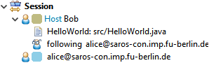
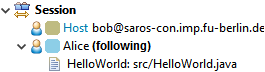
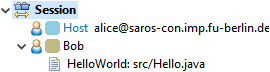
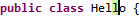
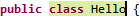
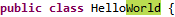
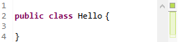

## Follow-Mode

The Saros view's session list shows which participant is currently following whom.

If you are following another participant you see something like:

## File Navigations

In the package explorer:
-  A colored dot decorates the file that a participant has currently
    in focus. The color resembles the color of the active user. If multiple users have the same file focused,
    the dot will turn grey ().
-  A
    blue arrow decorates a file that is shared with
    other participants.

In the Saros view's session list shows which participant has which editor focused.

## Cursors

The position of a participant's cursor appears in the file and
the character behind the cursor is highlighted with the
corrsponding color.

## Selections

Any text selected by a participant also appears highlighted in
the file.

## Changes

If a participant writes something, their text will appear
highlighted in their color.

## Viewports

On the right side of editors you can see colored bars representing
the viewports of each user. These show which part of the file each
user can see.
