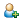
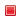



Here you will find a guideline **on how to set up Saros/E**.

After that you might want to find out **what Saros can do**: Here is the
complete [feature list](features.md).

## The Host

Before we get started you should know that Saros is a host-based system.

To get familiar with this concept check out our comic:

[//]: # This link does not point to a markdown file because Jekyll is unable to convert this nested link into a link with html extension

------------------------------------------------------------------------

## First Steps

### Step 1: Connecting

You first need an **XMPP account** to use Saros.

1.  You can **create a new account** on our XMPP server using our **[signup page](https://saros-con.imp.fu-berlin.de:5280/register/new)**.
  - Note: Due to abuse by spammers, we had to disable in-band registration and from within Saros.
2.  You can **use an existing account** or [setup your own XMPP server](setup-xmpp.md).
  - Please note that your mileage may vary depending on the XMPP server settings, such as bandwidth restrictions or feature supports.

Now you can start the *Saros Configuration* wizard (*Menu &gt;
Saros &gt; Start Saros Configuration*) to configure your account in Saros and connect.

### Step 2: Adding Contacts

To add a contact to your list you need to **know his/her XMPP ID**.

**After entering your partner's XMPP ID**, a message will be sent to
your contact.
Once s/he accepts your request you will be able to see his/her **online
status in your contact list**.

{:class="img-fluid"}

### Step 3: Starting and Joining Sessions

You can work together with your contacts by either **starting your own
session** or by **being invited to one**.

When **starting** a session, **Saros will copy the project** to the
computer of your invited contacts.

{:class="img-fluid"}

#### Start a Session ([host](#the-host))

1.  Right-click on...
  - a **project** in your **Package Explorer** and select *Share With* or
  - a **contact** in the **Saros View** and select *Work Together on*
2.  Wait for your contacts to accept the **session invitation**

Want to know more about the Saros host role? Check out our comic
[here](host-comic.md).

#### Join a Session (Client)

1.  Wait for a **session invitation** to appear on your screen
2.  Click *Accept* to **accept the invitation**
3.  Tell Saros **where to save the incoming project**:
  - You can create a **new project**, or
  - synchronize with an **already existing project** on your computer.
4.  Select *Finish* and wait for the project to be copied to your
    computer

#### Additional Information:

-   If you accept an invitation and decide to synchronize the incoming
    project with your own copy, Saros will automatically add, change, or
    delete all files as necessary.
-   Saros will share all files which are not marked as *derived* by
    Eclipse, because it should be possible to recreate such files
    (`.class` files for instance) at the client's side. If you use a
    build tool such as Ant, it might be necessary to manually set the
    resulting files or folders to *derived* on both the host's side (so
    they won't be copied to the client) and the client's side (otherwise
    the files will be deleted on synchronization).

### Step 4: Exploring the Saros View

The Saros View consists of three parts

-   the contact list
-   the session list
-   the chat area

The **contact list** is where all **your contacts** are, allowing you to
check their availability, send them instant messages, and invite them to
Saros sessions.

When you are in a Saros session you will see all **participants in the
session list**. Saros also provides **instant chat messaging** to
accompany your sessions.
Whenever you begin a Saros session, a **chat session** is also
automatically started.

{:class="img-fluid"}

### Step 5: Exploring the Saros Toolbar

#### General

**Connecting:**

Click here to connect or disconnect from the server, or to switch
between user accounts if you have more than one. When you connect, you
will see information about your contacts (including whether they are
connected and also whether they support Saros).

**Add Contact:**

To add a new contact click here (you will need the full XMPP address of
your contact in the format: `username@server`).

**Open Saros preferences:**

Opens the Saros section of the Eclipse preferences. This is a shortcut
for *Window &gt; Preferences &gt; Saros*.

**Inconsistency repair:**

Sometimes accidents can happen and your copy of the project can become
out of sync with the host's copy. When it does, this button will light
up. When you click it, the inconsistencies will be repaired.

**Switch Follow Mode on/off:**

You can turn the Follow Mode on and of. In Follow Mode Saros will
automatically sync your Eclipse view with the user you are following,
opening shared files the user is opening, and automatically scroll to
the visible part of the editor of open files, so you always see what the
followed user sees.

**Leave the session:**

Click here to leave the current session. If you are the
[host](#the-host), the session will be
closed and all participants will be ejected from the session.

#### Context Menu

**Grant Write Access:**

Gives the selected participant write access.

**Restrict to Read-Only Access:**

Removes the write access right from the selected participant. The
affected participant will only have read access afterwards.

**Follow Participant:**

Follows the selected participant as described in section [Follow Mode](#follow-mode).

**Jump to Position:**

Jumps to the cursor position of the selected participant and open the
corresponding file if necessary.

** Open
chat:**

Opens a chat with this contact on the right side.

**Send File:**

Gives you the opportunity to select a file to be sent to the selected
participant.

### Good to Know

#### User Roles

By default all participants of a session have **writing access**. To
restrict or grant this access to other participants, right-click on that
user in the session list and select *Restrict to read-only access* or
*Grant writing access*. This can **only be done by the
host**.

#### Follow Mode

You can use this feature to follow a single participant as s/he
navigates the project and performs changes. When you follow a
participant:

-   Whenever s/he opens a file on his/her computer, it is opened on
    yours too.
-   Any time s/he switches to view a different file, it is switched
    on yours.
-   As s/he scrolls through a file, the viewpoint is moved on your
    computer also, so that you see what s/he sees.

#### Staying Aware of Your Fellow Participants

There are multiple ways of staying aware of what a driver is currently
doing:

-   In the package explorer (or resource navigator):
    -  A colored dot decorates the file that a participant has currently
        in focus. The color resembles the color of the active user.
    -  A
        blue arrow decorates a file that is shared with
        other participants.
-   Cursors:
    The position of a participant's cursor appears in the file in
    his/her color.
-   Selections:
    Any text selected by a participant also appears highlighted in
    the file.
-   Changes:
    If a participant writes something, his/her text will appear
    highlighted in his/her color.
-   Locate participants:
    On the right side of editors you can see colored bars representing
    the viewports of each user. These show which part of the file each
    user can see.
-   Follow participants:
    Follow mode allows you to follow all movements of another user as
    s/he moves within and between files. In the Session list, right
    click on the user you wish to follow and select Follow Participant.





**This page contains information partially specific to the current release `0.2.2`. 
For information on previous releases, you can have a look at the corresponding [release notes](../releases/index.md).**

The development of the Saros/I plugin is still in the alpha stages, so expect it to be a bit rough around the edges.
There are still some [restrictions](#restrictions) that apply to the usage and some basic [features are still missing](#missing-features).

## Disclaimer

Saros/I does not include sub-modules when sharing a module (see [Module Restrictions](#module-restrictions)).
As a consequence, such sub-modules might not be present for all session participants.
If a participant deletes a shared directory that contains a sub-module in the local setup of another participant, this sub-module will be deleted without any notice.

Furthermore, there are still some known bugs in the current release. Please have a look at the section [Known Bugs](#known-bugs).

## Features

This alpha version provides most of the basic functionality of Saros.
You can

- add existing XMPP-accounts
- start a session with another person
  - Sessions in Saros/I are currently limited to two participants (host and one client)
- share exactly one module through Saros; the shared module must meet the restrictions described [here](#module-restrictions)
- transfer the initial content of the module shared by the host to all participating clients
- work on shared resources
- create, delete, and move resources in the shared module
- interact freely with non-shared resources
- follow other participants of the session ([follow mode](features.md#follow-mode))

### Sharing Complex Modules

Even though Saros offers the option to create the module on the client side as part of the session, this should only be used for relatively simple modules.
For more complex modules, it is advised to share the module structure some other way (e.g. a VCS) before starting a session. Saros currently does not set up things like libraries or module dependencies, meaning they would have to be configured by hand.

## Compatibility

The current release `0.2.2` is not compatible with the previous Saros/I releases (`0.1.0`, `0.2.0`, or `0.2.1`) or other Saros plugins (like Saros/E).

## How to Use Saros/I

Most interactions with the Saros session logic (like starting or ending a session) can be done through the Saros tool window.
This window is attached to the bottom right of the IDE by default.
It is marked with the title "Saros" and the Saros icon ().
All actions described in the following sections take place in this tool window.

### Creating an XMPP Account

Saros requires an XMPP account to connect to and communicate with other users. You can use an openly available XMPP server or [setup your own XMPP server](./setup-xmpp.md).

Furthermore, we also host an XMPP server (`saros-con.imp.fu-berlin.de`) specifically for the purpose of Saros that is freely available.
To use it, you will first have to create an account using the [signup page](https://saros-con.imp.fu-berlin.de:5280/register/new).

### Adding an XMPP Account

- In the top bar of the Saros view, click the "Connect" button ().
- Choose "Add account..." from the pop-up menu.
- Enter the fully qualified user name (`USER_NAME@YOUR.DOMIAN`) of the account you would like to add.
  - If the basic Saros XMPP server is used, the domain would be `@saros-con.imp.fu-berlin.de`.
- Click OK.
- Enter your password.
- Click OK.
- Enter the XMPP server address (optional).
  - This option should not be necessary in most cases.
  - If no server is supposed to be specified, just leave the field empty.
  - If a server is specified, a port has to be specified as well.

**NOTE:** As mentioned in the section [missing features](#missing-features), Saros/I does currently not support the creation, management or deletion of XMPP accounts.
As only people on your friends list can be invited to join your Saros session, you will have to create an account and add friends to your friends list through a different client.
Any XMPP client (including Saros/E) can be used for this purpose.

If you accidentally made a typo while entering your username or password, the created account entry can also only be changed or deleted through Saros/E (or by deleting the account store `~/.saros/config.dat`).
Saros/E does not permit the deletion of the currently chosen account.
If you only added one account and would like to remove it, you will have to add a second account (for example with random values) and choose this new account as the default.
You can then delete the first account, add a new account with the right values, choose it as the correct default and delete the temporary account entry.

### Connecting to an XMPP Account

- Click the "Connect" button ().
- Choose the account you would like to connect to from the pop-up menu.

### Adding a Contact to an XMPP Account

- Connect to the XMPP account you would like to add a contact to.
- Click the "Add Contact" button ().
- Enter the fully qualified user name (`USER_NAME@YOUR.DOMIAN`) of the contact you would like to add.
    - If the basic Saros XMPP server is used, the domain would be `@saros-con.imp.fu-berlin.de`.
- Click "OK".
- Enter a nickname for the contact (optional).
- Click "OK".
    - An additional dialog will be shown if the server does support user status requests. This does not impact the contact addition process, which can still completed by simply clicking "OK".

Once the other user has accepted your contact request, they will request you adding them as a contact as well.
This will automatically be displayed by the plugin as a dialog when you are connected to the account.

### Starting a Session - Host

- Connect to the XMPP account you would like to use.
- Choose the section "Contacts" in the window on the left side of the Saros view.
- Choose a friend that is online.
- Right-click the name of that friend. This will open a list of all open projects. Each project contains a list of its shareable modules.
  - If the module you would like to share is not listed, it most likely does not adhere to the mentioned restrictions (see [module restrictions](#module-restrictions)).
- Choose the module that is supposed to be shared from the displayed list of modules.

*Alternatively:*

- Select a module in the project view and right-click it.
- Select "Share With..." from the options (or use the keyboard-shortcut 's').
- Select a user from the list (or use their number as the keyboard-shortcut).

### Starting a Session - Client

- Connect to the XMPP account you would like to use.
- Wait until the host invites you to join their session.
- After the host invited you, the session negotiation will open.
- Click "Next". This will open the project negotiation.
- Choose which project to use. This can be done through the drop-down menu at the top of the dialog.
- Choose how to represent the shared module locally. You can either choose an existing module or create a new one
  - *To create a new module:* Choose "Create new module"
    - Specify a module name (must not already exist in the shared project).
    - Specify the module base path.
  - *To use an existing module:* Choose "Use existing module"
    - Select a module from the drop-down menu.
      - If the module you would like to share is not listed, it most likely does not adhere to the mentioned restrictions (see [module restrictions](#module-restrictions)).
- Click "Next".
  - If an existing local module was chosen, a list of local file changes that will be made during the negotiation will be shown. These are the differences between the local version of the module and the version held by the host. The shown actions are the actions necessary to align the local module with the host module.
  - **Warning:** Any local differences will be removed during the project negotiation. These adjustments will only be done if the "Finish" button is selected. If the project negotiation is aborted at this stage, no local files are changed.
- Click "Finish".

### Changing User Colors

- Open the [IntelliJ settings/preferences menu](https://www.jetbrains.com/help/idea/settings-preferences-dialog.html).
- Navigate to `"Editor" > "Color Scheme" > "Saros"`.
- Select the color scheme to change the colors for.
- Expand the user whose colors to change.
  - Currently, Saros internally has the concept of 5 user colors that will be used locally. These will be negotiated and assigned to the session participants when a session is started. As a consequence, the other user in a two-user-session will not necessarily have the user color 1.
- Choose the annotation type to change the color for.
- Adjust the way the annotation is displayed using the options on the right.
  - These changes will be previewed in the frame on the bottom.

### Following Another Participant

- Click the "Follow" button ().
- Select the user to follow from the list and click the entry.

*Alternatively:*

- Select another participant in the list of session participants in the session view (on the left) and right-click their name.
- Click the option "Follow participant".

### Leaving the Follow Mode

- Click the "Follow" button ().
- Click the option "Leave follow mode".

### Resolving a Desynchronization

By default, the synchronization button () is disabled.
If Saros detects that the local content has become out of sync with the host (i.e. differs in any way), it will notify the user and enable the synchronization button ().
To resolve the desynchronization:

- Click the "Synchronization" button (). This will open the recovery dialog.
- Click "Yes".
  - **WARNING** As stated in the dialog, this will replace the content of the affected file(s) with the content of the corresponding file(s) on the host's side.
  This might override recent changes to the local files. To avoid data-loss, consider making a backup of the affected files/changes before executing the synchronization recovery.

### Leaving a Session - Host

- Click on the "Terminate session" button ().
- Select "OK".
    - As you are the host of the session, this will cause the session to end, kicking all other participants.

### Leaving a Session - Client

- Click on the "Leave session" button ().
- Select "OK".

### Disconnecting From the XMPP Server

- Click on the "Connect" button ().
- Choose "Disconnect server".

## Restrictions

Some of the implemented features are still subject to some restrictions:

### Module Restrictions

You can currently only share a single module. A module has to adhere to the following restrictions to be shareable through Saros:

- The module must have exactly one content root.

Sharing a module will only share resources belonging to that module, not resources belonging to sub-module located inside a content root of the module.
Creating such a sub-module during a session will lead to an inconsistent state that can not be resolved by Saros. See [Known Bugs](#known-bugs).

### Working With Newly Created Modules

To share a newly created module, you will have to have saved your project at least once before trying to start a session.
This is necessary as the module file for a new module is only written to disk the first time the module is saved.

You can check if the module file was written to disk by looking at the base directory of the module. It should contain a `*.iml` file with the same name as the module.

### Resource Exclusion Options Are Not Shared

Saros/I does not currently share which resources are marked as 'Excluded' with other participants. This can lead to a situation where another participant creates a resource on their side that already exists as an excluded resource locally. This leads to a session desync. See [Known Bugs](#known-bugs).

### Number of Participants

Currently, Saros/I is restricted to two-participant sessions, meaning you can only create session containing the host and a single client.

## Missing Features

As this is only the first alpha release, there are still a lot of main features that are not yet implemented:

- Multi-user sessions
- Sharing multiple modules
- Sharing whole projects
- Display viewport annotations
- Display file awareness annotations
- Display cursor annotation
- Display user color in Saros view
- Adjustable Saros settings (besides colors)
- Creation, management or deletion of XMPP accounts

### Missing Secondary Features

These are features that are part of the functionality provided by Saros/E but are not seen as a crucial aspects of the plugin and are therefore have a lower priority:

- Partial sharing
- Saros help entry in menu-bar
- Whiteboard
- Chat

## Known Bugs

There are some bugs in the alpha version of Saros/I that we are already aware of and that are going to be fixed in a later release. Some notable bugs are mentioned here. For a full overview, you can have a look at our [issue tracker](https://github.com/saros-project/saros/issues?q=is%3Aissue+label%3A%22Area%3A+IntelliJ%22+label%3A%22Type%3A+Bug%22+is%3Aopen).

- [#116](https://github.com/saros-project/saros/issues/116) - The position of local text selection is not updated correctly for closed files when text edits are received through Saros.
- [#223](https://github.com/saros-project/saros/issues/223) - Deleting and then re-creating a file with the same name (or moving a file and then moving it back, etc.) causes the session to desynchronize irreparably, requiring a session restart.
- [#683](https://github.com/saros-project/saros/issues/683) - Creating a file with an unknown file extension (or without a file extension) leads to a session desynchronization. Opening the file on the other side, choosing a file type, and then running the recovery might repair the session, but the state could also be irreparable, requiring a session restart.
- [#698](https://github.com/saros-project/saros/issues/698) - Creating a submodule in a shared directory leads to a session desync.
- [#699](https://github.com/saros-project/saros/issues/699) - Which resource are marked as excluded is not shared between participants.
- [#707](https://github.com/saros-project/saros/issues/707) - Client line endings are overwritten with host line endings when starting a session.
- [#711](https://github.com/saros-project/saros/issues/711) - Opening a non-text-editor for shared resources leads to user-visible error.
- [#821](https://github.com/saros-project/saros/issues/821) - Changing XMPP accounts during a session freezes/blocks the IDE.
- [#822](https://github.com/saros-project/saros/issues/822) - The state of the Saros view is not reset correctly when the the host is unexpectedly disconnected from the XMPP server.

### Report a Bug

If you encounter any other bugs not mentioned above, we would appreciate it if you would report them to our issue tracker (after checking that they have not already been reported).

Our current bug tracker can be found on our [GitHub page](https://github.com/saros-project/saros/issues).
Please make it clear that the issue is dealing with Saros/I.

When reporting a bug that concerns the plugin behavior, please provide the Saros log file (or all relevant excerpts) for a session where the bug was encountered.
The log files can be found in the IntelliJ settings directory, which usually resides in the home directory under `~/.IdeaXXXXXXXX/` (".IdeaXXXXXXXX" designates the used IntelliJ release; for IntelliJ IDEA Community Edition 2018.2, this would be `.IdeaIC2018.2`).
The log files are located in `~/.IdeaXXXXXXXX/system/log/SarosLogs/`.

If you are encountering IntelliJ IDEA errors connected to Saros (which will be displayed by a red, blinking symbol in the bottom right corner of the IntelliJ project view; the error can be viewed in more detail by clicking the symbol), please also include the IntelliJ IDEA logs.
They are located in `~/.IdeaXXXXXXXX/system/log/` and are named `idea.log` (the log will be truncated at some point and older logs will be moved to `idea.log.1`, etc.).
Please have a look at the contained timestamps to provide the correct file.

Before attaching any log files, please make sure to redact any private information that you do not wish to make publicly available.




