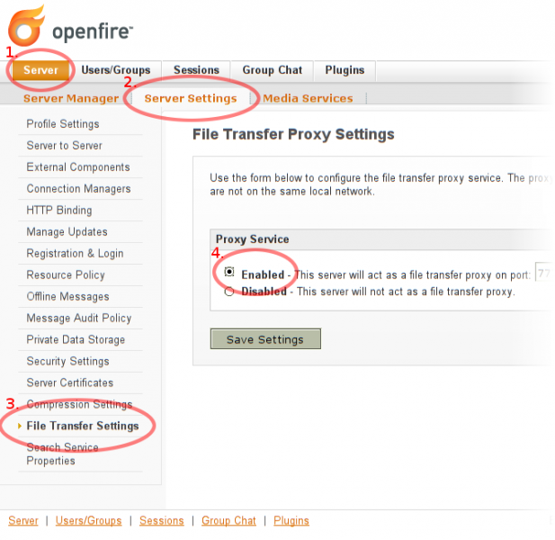

# {{ page.title }}
{:.no_toc}

If you are an experienced user or if you want to use Saros in your
company and you want to use another XMPP Server or set up your own with
Openfire, you will find information below.

## XMPP servers

In order to use Saros you need to configure an XMPP/Jabber account.

-   It is recommended to **use the same XMPP server** for all users
    which participate in a Saros session, because our tests have shown
    that many public XMPP servers use outdated software
    and certificates. Thus in many cases communication between federated
    servers will fail.
-   If you want to **use Saros in a company** or with more than one
    peer, we recommend using your own XMPP server. From our own testing
    we can
    recommend [OpenFire](http://www.igniterealtime.org/projects/openfire/index.jsp) (others
    such as [ejabberd](http://www.process-one.net/en/ejabberd/) should
    be suitable as well)

### Suitable Jabber servers

*   The following public Jabber servers have been tested to **work
    reliably with no known problems**:
    *   [jabber.org](http://www.jabber.org/) - [In-Band
        Registration](http://xmpp.org/extensions/xep-0077.md) disabled,
        thus you need to
        visit [register.jabber.org](http://register.jabber.org/) to
        create an account.
*   The following public Jabber servers **have known minor issues**, but
    should work in general:
    *   [jabber.ccc.de](http://web.jabber.ccc.de/) - No support
        for [In-Band
        Bytestream](http://xmpp.org/extensions/xep-0047.md), thus not
        suitable for firewalled users.
    *   [jabber.se](http://www.jabber.se/) - Outdated certificates, thus
        communication between federated servers will likely fail.
    *   [jabber.no](http://www.jabber.no/) - [In-Band Bytestream file
        transfers](http://xmpp.org/extensions/xep-0047.md) are
        incompatible with our [XMPP API
        Smack](http://www.igniterealtime.org/projects/smack/), thus if
        you do not have a P2P connection Saros will not work.
    *   [jabber.cc](http://www.jabber.cc/) - Outdated certificates and
        frequent out-takes
*   [List of other public servers](http://xmpp.org/services/)

## eJabberD (Linux)

See [https://www.ejabberd.im](https://www.ejabberd.im/).

## Openfire installation (Windows)

1.  Download [Openfire for
    Windows](http://www.igniterealtime.org/downloads/index.jsp)
2.  The installation requires administrator privileges.
3.  When the installation wizard asks about database settings choose the
    embedded database.
4.  Enable the proxy service under Server &gt; Server Settings &gt; File
    Transfer Settings. (Should be the default value but it had to be
    disabled for Saros in the past.)

